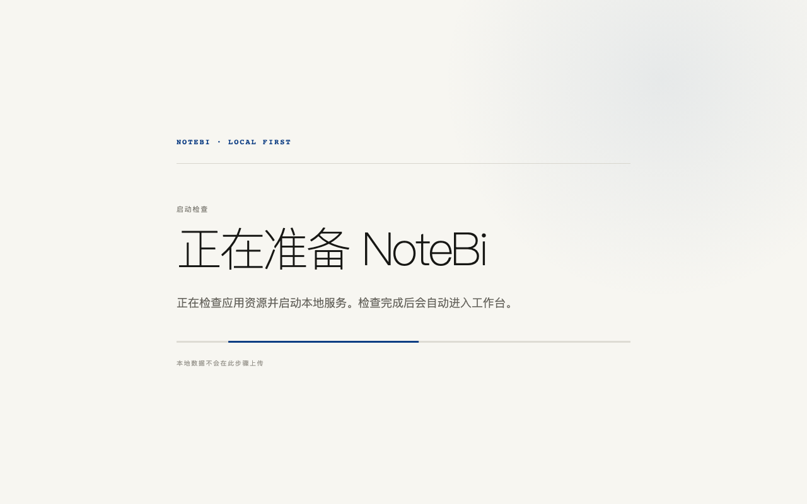
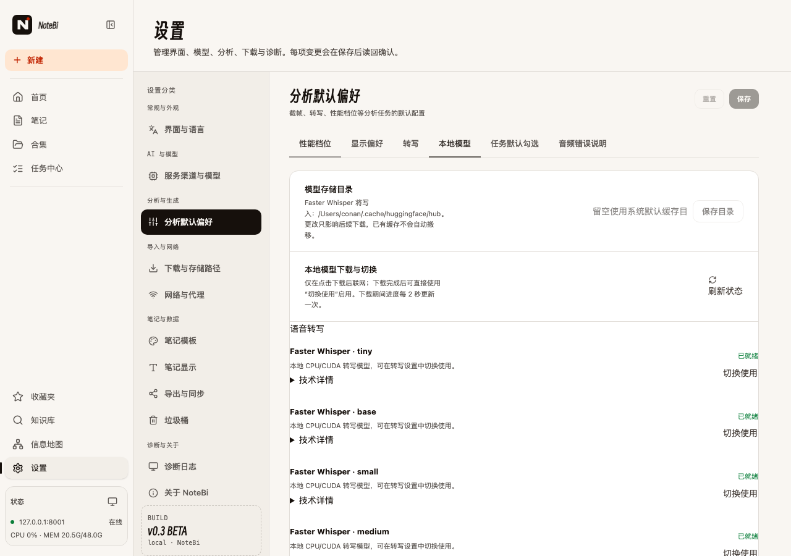

<h1 align="center">NoteBi</h1>

<p align="center"><i>本地优先的 AI 多媒体笔记工具 · 把视频、音频、图文和文字整理成可编辑的结构化笔记</i></p>

<p align="center">
  
  
  
  
  
</p>

<p align="center">
  
  
</p>

<p align="center"><a href="docs/media/notebi-feature-intro-70s.mp4">观看 70 秒功能介绍视频</a></p>

---

## NoteBi 是什么

NoteBi 是一个本地优先的内容笔记工具。它可以导入本地视频、音频、图片、文字或公开内容链接，完成转写、说话人识别、字幕翻译、结构化总结和多格式导出。

默认情况下，素材、笔记、模型缓存和运行日志都保存在本机。NoteBi 不会把本地文件自动上传到项目维护者的服务器；是否调用第三方模型服务，由使用者自己在设置中配置。

> 本项目处于持续开发阶段。请遵守第三方平台条款、素材版权、模型许可证和所在地法律法规。

## 功能

- 视频、音频、图片、文字和公开链接导入
- 本地语音转写、字幕编辑和字幕翻译
- 说话人识别、说话人改名和角色标注
- 普通总结与区分说话人的会议、访谈、客户接待等总结
- 总结版本保留、时间点跳转和原始素材回看
- Markdown、HTML、PDF、Word、Obsidian 等导出
- 本地知识库、向量检索和跨笔记问答
- OpenAI-compatible 模型服务配置
- 支持把 Chat、Embedding、Rerank 分别配置到不同服务

## 当前发布状态

NoteBi 已具备源码运行方式，并正在 `codex/release-github` 分支构建 Tauri 2 桌面预览包。Windows x64 使用可选择安装目录的 NSIS 安装器，Linux x64 生成 AppImage 与 `.deb`；Apple 发行等待开发者账号通过后再接入。**当前仍没有经过目标平台完整实机验收的正式安装包。**

| 平台 | 当前可用方式 | 状态 |
|---|---|---|
| macOS Apple Silicon / Intel | 源码 + `.command` 启动器 | Apple 签名、公证和桌面 job 暂缓 |
| Windows x64 | NSIS `.exe` 无签名开发预览 | CI 构建；会显示未知发布者 / SmartScreen 提示，正式 Release 仍需实机验收 |
| Linux x64 | AppImage + `.deb` CPU 开发预览 | CI 使用 CPU-only PyTorch，避免把 CUDA 运行时误装进发行包；仍需 Ubuntu 实机验收 |
| 自动化产物 | GitHub Actions Artifacts | 通过 sidecar `/health` smoke test 后上传，尚不等于正式 Release |

不要把构建成功等同于安装和媒体能力已经验收。预览产物先保存在 GitHub Actions；实机验收通过后才会发布到 [GitHub Releases](https://github.com/garyconan1224/notebi/releases)。

当前可供测试的 Windows/Linux 预览安装包见 [Desktop Preview Packages 工作流](https://github.com/garyconan1224/notebi/actions/workflows/desktop-preview.yml)。仓库目前为私有仓库，下载时需要登录有权限的 GitHub 账号。

### 桌面预览版的启动流程

1. 安装器只安装 NoteBi、前端资源、本地 Python sidecar 和 FFmpeg；不会下载模型。
2. 应用启动时创建独立的用户数据目录，启动本地后端并等待 `/health`。
3. 只有应用资源和后端健康检查通过后才进入主页面。
4. 需要本地转写模型时，进入「设置 → 本地模型」，先保存模型存储目录，再点击具体模型的下载按钮。

AppImage 为避免 Linux 打包器改写 Python/FFmpeg 私有二进制，会把随应用提供的本地运行时作为校验归档保存。首次启动时 NoteBi 会先校验并解包到系统分配的用户数据目录，完成后才进入工作台；这不是模型下载，后续启动会复用同一份运行时。建议首次启动前预留至少 3 GB 可用空间。

## 技术栈

| 层 | 技术 |
|---|---|
| 前端 | React 19 · TypeScript · Vite 8 · Tailwind 4 |
| 后端 | Python 3.11 · FastAPI · 本地文件 / SQLite |
| 转写与说话人 | MLX-Whisper · Faster-Whisper · WeSpeaker |
| 下载与媒体 | yt-dlp · FFmpeg · OpenCV |
| 知识库 | FAISS · 可配置 Embedding / Rerank 模型 |

## 运行方式选择

| 方式 | 适用对象 | 运行条件 |
|---|---|---|
| 源码模式 | 开发者、需要改代码的人 | Python、Node.js、FFmpeg |

## 快速开始：macOS

### 环境要求

- macOS 12+
- Python 3.11+
- Node.js 18+
- FFmpeg
- 可访问的模型服务，或已经准备好的本地模型缓存

首次安装依赖：

```bash
./start-notebi.command
```

开发启动：

```bash
./dev-notebi.sh
```

启动后访问：

```text
http://localhost:5181
```

停止：

```bash
./stop-notebi.command
```

完整 macOS 说明见 [INSTALL_MACOS.md](docs/INSTALL_MACOS.md)。

## 快速开始：Windows 源码模式

完整 Windows 说明见 [INSTALL_WINDOWS.md](docs/INSTALL_WINDOWS.md)。

源码模式适合需要改 Python、React 或模型适配代码的用户。

### 1. 安装基础环境

安装 Python 3.11、Node.js 18+ 和 FFmpeg，并确保 `python`、`npm`、`ffmpeg` 可以在终端中使用。

### 2. 安装 Python 依赖

在仓库根目录运行：

```powershell
py -3.11 -m venv .venv
.\.venv\Scripts\python.exe -m pip install -r requirements.txt
```

### 3. 安装前端依赖

```powershell
cd frontend
npm install
cd ..
```

### 4. 启动

```text
双击 start-notebi.bat
```

启动器使用 `.venv` 和本机 Node.js；启动日志在 `.local\backend.log`、`.local\frontend.log`。

停止：

```text
双击 stop-notebi.bat
```

## 模型配置与下载

本地转写模型在应用内「设置 → 本地模型」管理。你可以把模型目录放在空间更大的磁盘，保存并回读成功后，再点击具体模型的下载按钮。安装器和首次启动页都不会下载模型，模型未安装也不会阻止 NoteBi 打开。

远程 Chat、Vision、Embedding、Rerank 等服务仍在「设置 → 模型与渠道」配置。源码模式默认写入仓库 `.local/settings.json`；桌面版写入操作系统分配给 NoteBi 的用户状态目录。打包脚本不会复制、覆盖或提交现有设置、API Key 或模型服务凭据。

支持的常见配置方式：

- OpenAI-compatible 服务：填写服务地址、模型名和 API Key。
- 本机模型服务：填写 `http://127.0.0.1:<port>/v1`。
- Chat、Embedding、Rerank：可以分别指定不同 provider。

首次启动没有模型服务时，界面仍然可以打开；需要生成总结、翻译或知识库问答时，再配置对应能力的模型。

## 开发与验证

```bash
# 后端测试
./.venv/bin/python -m pytest backend/tests -q

# 前端测试与构建
cd frontend
pnpm test --run
pnpm build
cd ..

# 源码树预检
./.venv/bin/python scripts/source_preflight.py --root .
```

## 全平台发行路线

桌面交付使用 Tauri 2 承载窗口和生命周期，用平台原生构建的 Python 后端作为 sidecar。PyInstaller 不是跨平台交叉编译器，因此 Windows、macOS 和 Linux 必须分别在对应系统构建和验收。

当前目标资产是 Windows x64 无签名 NSIS 开发版，以及 Linux x64 的 `.AppImage` 和 `.deb`；Apple 资产后置。代码签名、模型许可证、应用内按需下载和实机验收门槛见 [CROSS_PLATFORM_RELEASE.md](docs/CROSS_PLATFORM_RELEASE.md)。

## 目录结构

```text
backend/        FastAPI API、任务和处理流程
frontend/       React + TypeScript 前端
shared/         配置、provider、转写、说话人和知识库共享模块
scripts/        预检、启动、静态服务和发行包工具
src-tauri/      桌面窗口、sidecar 生命周期和平台安装配置
packaging/      Python sidecar 入口与发行构建依赖
docs/           安装、开源和内网部署文档
backend/tests/  后端测试
```

## 贡献与安全

- 贡献说明见 [CONTRIBUTING.md](CONTRIBUTING.md)。
- 安全问题见 [SECURITY.md](SECURITY.md)，不要在公开 Issue 中提交密钥、Cookie 或私人素材。
- 支持范围见 [SUPPORT.md](SUPPORT.md)。

## 代码参考与致谢

- 产品形态与交互受到 [BiliNote](https://github.com/JefferyHcool/BiliNote) 启发。
- 视频下载基于 [yt-dlp](https://github.com/yt-dlp/yt-dlp)，本地转写使用 [MLX-Whisper](https://github.com/ml-explore/mlx-examples) / [faster-whisper](https://github.com/SYSTRAN/faster-whisper)。

## License

[MIT](LICENSE)

## Star History

[](https://www.star-history.com/#garyconan1224/notebi&Date)
